# AI Engineer Guide

This document is for an engineer who needs to understand how the shipped product works today, where the LLM calls are, how state moves through the system, and where to change behavior safely.

## 1. What the product is now

The public product in this repository is **Sentiment Simulator**. It is not a general-purpose simulation workbench in the current frontend. The shipped user path is:

1. Submit a structured product seed.
2. Generate ontology and build a knowledge graph.
3. Create a campaign with three simulations.
4. Prepare all three scenarios asynchronously.
5. Run all scenarios in parallel.
6. Analyze sentiment and compare outcomes in one dashboard.

The launch surface is intentionally narrow. Legacy graph, report, and interaction capabilities still exist in the backend, but they are not the primary public workflow.

## 2. Mental model

The easiest way to understand the system is as a staged pipeline:

```mermaid
flowchart LR
    A[Seed Template] --> B[Seed Preview]
    B --> C[Ontology Generation]
    C --> D[Graph Build in Zep]
    D --> E[Campaign Creation]
    E --> F[Async Preparation]
    F --> G[Three Simulation Configs]
    G --> H[Parallel OASIS Runs]
    H --> I[Action Logs]
    I --> J[Sentiment Analysis]
    J --> K[Dashboard / Comparison]
```



There are four major system concerns:

- **Input modeling**: convert structured product input into graph-ready and simulation-ready context.
- **Scenario orchestration**: provision, prepare, and run three comparable simulations.
- **Runtime observation**: watch subprocesses, parse action logs, and expose current run state.
- **Post-run analysis**: classify content, compute metrics, and cache results.

## 3. What ships on the frontend

The active frontend route is centered on [`frontend/src/views/SentimentView.vue`](../frontend/src/views/SentimentView.vue).

The page orchestrates four operator steps:

1. `SeedTemplateForm` collects the launch brief.
2. `ArchetypeReview` shows the audience model.
3. `CampaignRunView` tracks scenario execution and allows manual event injection.
4. `SentimentDashboard` renders analytics and cross-scenario comparison.

The frontend persists campaign context in session storage and uses polling heavily. It does not hold the authoritative state. The backend owns state and persists it on disk.

## 4. End-to-end request flow

### Step 1: seed preview

Frontend calls:

- `POST /api/sentiment/seed/validate`
- `POST /api/sentiment/seed/preview`

Backend implementation:

- [`backend/app/api/sentiment.py`](../backend/app/api/sentiment.py)
- [`backend/app/services/seed_template_processor.py`](../backend/app/services/seed_template_processor.py)

The seed template processor does two important things:

- builds a structured markdown document for the graph pipeline
- builds a `simulation_requirement` string for downstream simulation config generation

This is the point where launch data is normalized into a reusable internal format.

### Step 2: ontology generation

Frontend calls:

- `POST /api/graph/ontology/generate`

Backend implementation:

- [`backend/app/api/graph.py`](../backend/app/api/graph.py)
- [`backend/app/services/ontology_generator.py`](../backend/app/services/ontology_generator.py)

This endpoint:

1. creates a persisted project
2. saves uploaded files into `uploads/projects/<project_id>/files/`
3. extracts and preprocesses text
4. sends document text plus simulation requirement to the ontology generator
5. persists ontology and analysis summary into `project.json`

### Step 3: graph build

Frontend calls:

- `POST /api/graph/build`
- `GET /api/graph/task/<task_id>`
- `GET /api/graph/data/<graph_id>`

Backend implementation:

- [`backend/app/api/graph.py`](../backend/app/api/graph.py)
- [`backend/app/models/task.py`](../backend/app/models/task.py)
- [`backend/app/services/graph_builder.py`](../backend/app/services/graph_builder.py)

The graph build is asynchronous. A background thread:

1. chunks extracted text
2. creates a graph in Zep
3. applies ontology
4. uploads text batches
5. waits for Zep processing
6. fetches graph summary

Task progress is persisted to disk, not just kept in memory.

### Step 4: campaign creation

Frontend calls:

- `POST /api/sentiment/campaign/create`

Backend implementation:

- [`backend/app/api/sentiment.py`](../backend/app/api/sentiment.py)
- [`backend/app/services/campaign_manager.py`](../backend/app/services/campaign_manager.py)
- [`backend/app/services/simulation_manager.py`](../backend/app/services/simulation_manager.py)

Campaign creation does not start simulation. It provisions **three simulation IDs**:

- Scenario A: baseline
- Scenario B: competitive pressure
- Scenario C: crisis

Each scenario gets its own simulation directory and persisted state.

### Step 5: campaign preparation

Frontend calls:

- `POST /api/sentiment/campaign/<campaign_id>/prepare`
- `GET /api/sentiment/campaign/<campaign_id>/prepare/status`

Preparation is asynchronous and backed by the task manager. The `CampaignManager` spawns a background thread and updates task state as preparation proceeds.

The current launch path uses an **archetype bypass**:

- it does **not** depend on Zep entity extraction for population modeling
- it does **not** use the older LLM-heavy profile generation path during normal launch flow

Instead, it generates a synthetic archetype population once and reuses it for all three scenarios.

### Step 6: run campaign

Frontend calls:

- `POST /api/sentiment/campaign/<campaign_id>/start`
- `GET /api/sentiment/campaign/<campaign_id>`

`CampaignManager.start_campaign()` starts a background thread, which then runs all three scenarios in parallel using `ThreadPoolExecutor`.

Each scenario calls into [`backend/app/services/simulation_runner.py`](../backend/app/services/simulation_runner.py), which launches a subprocess running one of the OASIS wrapper scripts:

- `backend/scripts/run_parallel_simulation.py`
- `backend/scripts/run_twitter_simulation.py`
- `backend/scripts/run_reddit_simulation.py`

### Step 7: sentiment analysis and comparison

Frontend calls:

- `GET /api/sentiment/campaign/<campaign_id>/sentiment`
- `GET /api/sentiment/campaign/<campaign_id>/compare`

Backend implementation:

- [`backend/app/services/sentiment_analyzer.py`](../backend/app/services/sentiment_analyzer.py)

This service reads action logs from each scenario, classifies posts with an OpenAI-compatible model, computes metrics, and caches the result until the underlying logs change.

## 5. Core runtime objects

### Project

Purpose: graph-building unit tied to uploaded source material.

Persisted by:

- [`backend/app/models/project.py`](../backend/app/models/project.py)

Stored under:

- `backend/uploads/projects/<project_id>/`

Important files:

- `project.json`
- `extracted_text.txt`
- `files/*`

### Task

Purpose: persisted status for long-running background jobs.

Persisted by:

- [`backend/app/models/task.py`](../backend/app/models/task.py)

Stored under:

- `backend/uploads/tasks/<task_id>.json`

Used for:

- graph build progress
- campaign preparation progress

### Simulation

Purpose: one runnable market simulation tied to one scenario.

Persisted by:

- [`backend/app/services/simulation_manager.py`](../backend/app/services/simulation_manager.py)

Stored under:

- `backend/uploads/simulations/<simulation_id>/`

Important files:

- `state.json`
- `simulation_config.json`
- `run_state.json`
- `reddit_profiles.json`
- `twitter_profiles.csv`
- `archetype_map.json`
- `sentiment_cache.json`
- `simulation.log`
- `twitter/actions.jsonl`
- `reddit/actions.jsonl`

### Campaign

Purpose: orchestration layer that groups three simulations into one launch experiment.

Persisted by:

- [`backend/app/services/campaign_manager.py`](../backend/app/services/campaign_manager.py)

Stored under:

- `backend/uploads/campaigns/<campaign_id>/campaign.json`

## 6. Background execution model

This system uses three different execution styles, and confusing them is one of the fastest ways to get lost.

### A. Flask request thread

Used for:

- normal API requests
- status reads
- quick synchronous operations

### B. Python background threads

Used for:

- graph build background work
- campaign preparation
- campaign-level monitoring and orchestration

These threads update persisted JSON state so the frontend can poll safely.

### C. Child subprocesses

Used for:

- actual OASIS simulation runs

The subprocess boundary matters because simulation runtime output is not just in memory. It is written to files and later re-read by the monitoring layer.

## 7. What `CampaignManager` actually does

`CampaignManager` is the most important orchestration class in the launch path.

Responsibilities:

- creates three simulation records for one campaign
- starts asynchronous preparation
- generates one archetype population and shares it across all scenarios
- calls `SimulationManager.prepare_simulation()` three times
- runs scenarios in parallel
- schedules scenario-specific event injections
- aggregates scenario run state for the frontend

Important design choice:

All three scenarios share the same seed-derived graph context and the same archetype population. The scenarios diverge only because of event timing and event type. That makes the comparison more meaningful.

## 8. Scenario injection model

There are two injection mechanisms.

### Automatic staggered injection

During campaign execution:

- Scenario B gets competitive pressure
- Scenario C gets crisis pressure

The configured base rounds come from environment-backed config:

- `SENTIMENT_SCENARIO_B_INJECT_ROUND`, default `7`
- `SENTIMENT_SCENARIO_C_INJECT_ROUND`, default `14`

The manager can schedule **staggered** injections across high-, mid-, and low-activity tiers instead of broadcasting the same event to everyone at once.

### Manual injection

The frontend exposes a manual "God's Eye" injection panel in [`frontend/src/components/CampaignRunView.vue`](../frontend/src/components/CampaignRunView.vue).

That hits:

- `POST /api/sentiment/campaign/<campaign_id>/inject`

Under the hood it calls `SimulationRunner.interview_all_agents(...)`, which pushes an event prompt into a running scenario.

## 9. What `SimulationManager` actually does

`SimulationManager` prepares a simulation directory so it can be run by OASIS scripts.

The preparation flow is:

1. load simulation state
2. either use archetype profiles or read graph entities from Zep
3. generate and save profiles
4. call `SimulationConfigGenerator`
5. save `simulation_config.json`
6. patch config when archetype mode is used
7. mark the simulation as `ready`

Important current behavior:

- In the launch path, `archetype_profiles` is provided, so the older Zep-entity-to-profile path is skipped.
- Because the config generator receives no graph-derived entities in archetype mode, the code patches `agent_configs` and `agents_per_hour_*` afterward.

That post-generation patch is not incidental. It is required to make the archetype path produce realistic config output.

## 10. What `SimulationRunner` actually does

`SimulationRunner` is the boundary between prepared config and active runtime.

Responsibilities:

- loads `simulation_config.json`
- computes total rounds from time config
- launches OASIS wrapper scripts in a subprocess
- persists `run_state.json`
- tails action logs from Twitter and Reddit folders
- tracks per-platform completion
- exposes recent actions for live UI updates
- optionally streams agent activity into Zep graph memory

Important runtime detail:

The monitoring layer treats the action logs as the ground truth for what happened during the run.

If you are debugging a simulation, inspect:

- `simulation.log`
- `twitter/actions.jsonl`
- `reddit/actions.jsonl`
- `run_state.json`

before assuming the frontend or API is wrong.

## 11. LLM touchpoints

There are several different kinds of model calls in this repo.

### A. Ontology generation

File:

- [`backend/app/services/ontology_generator.py`](../backend/app/services/ontology_generator.py)

Purpose:

- turn source documents plus simulation requirement into graph ontology

Notes:

- this is earlier-generation, graph-oriented logic
- it is still on the critical path because the launch flow still builds a graph

### B. Simulation config generation

File:

- [`backend/app/services/simulation_config_generator.py`](../backend/app/services/simulation_config_generator.py)

Purpose:

- generate time config, event config, platform config, and agent config defaults

Notes:

- uses OpenAI-compatible chat completions
- in launch mode, output is later patched because archetype mode bypasses graph-derived entities

### C. Legacy profile generation

File:

- [`backend/app/services/oasis_profile_generator.py`](../backend/app/services/oasis_profile_generator.py)

Purpose:

- generate richer agent profiles from graph entities

Notes:

- this path is still in the codebase
- it is not the main launch population path
- launch uses predefined archetypes instead

### D. Sentiment classification

File:

- [`backend/app/services/sentiment_analyzer.py`](../backend/app/services/sentiment_analyzer.py)

Purpose:

- classify post sentiment and topics
- extract top objections

Notes:

- this is the most visible LLM feature in the shipped dashboard
- analysis is cached using action-log signatures

### E. Report agent

Files under `backend/app/services/report_agent.py`

Purpose:

- legacy report/chat subsystem

Notes:

- not launch-critical in the current frontend
- useful to know about, but not the first place to modify if you are working on the shipped sentiment product

## 12. Archetype system

The archetype library is one of the most important product-specific layers.

Primary file:

- [`backend/app/services/archetype_library.py`](../backend/app/services/archetype_library.py)

What it defines:

- population percentages
- risk tolerance
- price sensitivity
- social influence
- activity level
- sentiment bias
- sentiment momentum
- influence weight
- churn threshold
- writing style modifiers
- persona templates

The current shipped population includes segments such as:

- Early Adopter
- Budget Buyer
- Skeptic
- Enterprise Buyer
- Power User
- Privacy Cautious
- Viral Amplifier
- Domain Expert
- Support Seeker

Why this matters:

- scenario outputs become segment-aware instead of market-average
- sentiment analysis can compute persona heatmaps and faction behavior
- event diffusion can be reasoned about using activity level and influence weight

## 13. Sentiment analysis model

`SentimentAnalyzer` reads actions from:

- `twitter/actions.jsonl`
- `reddit/actions.jsonl`
- fallback flat `actions.jsonl`

It then:

1. extracts post-like content only
2. batches posts into one LLM call for sentiment plus topic tags
3. applies per-agent momentum smoothing
4. builds a round timeline
5. computes weighted averages using archetype influence weights
6. computes factions
7. extracts top objections from negative posts
8. builds persona heatmaps
9. detects anomalies
10. caches the result

Important implementation detail:

Cache invalidation is based on file size and modification time of action logs. If those change, the analyzer recomputes and overwrites the cached entry.

## 14. Frontend orchestration details

The frontend is opinionated and mostly orchestration code.

Important files:

- [`frontend/src/views/SentimentView.vue`](../frontend/src/views/SentimentView.vue)
- [`frontend/src/components/CampaignRunView.vue`](../frontend/src/components/CampaignRunView.vue)
- [`frontend/src/components/SentimentDashboard.vue`](../frontend/src/components/SentimentDashboard.vue)
- [`frontend/src/api/sentiment.js`](../frontend/src/api/sentiment.js)
- [`frontend/src/api/graph.js`](../frontend/src/api/graph.js)

Useful behavior to know:

- graph build polling uses `GET /api/graph/task/<task_id>`
- campaign preparation polling uses `GET /prepare/status`
- run monitoring polls `GET /campaign/<campaign_id>`
- dashboard refresh calls the sentiment API on demand
- session storage is used to resume workflow state after refresh

## 15. File-system layout you will inspect most often

```text
backend/uploads/
  campaigns/
    camp_xxx/
      campaign.json
  projects/
    proj_xxx/
      project.json
      extracted_text.txt
      files/
  simulations/
    sim_xxx/
      state.json
      run_state.json
      simulation_config.json
      reddit_profiles.json
      twitter_profiles.csv
      archetype_map.json
      sentiment_cache.json
      simulation.log
      twitter/
        actions.jsonl
      reddit/
        actions.jsonl
  tasks/
    <task_id>.json
```

If you understand this layout, you can debug most product issues without stepping through every request.

## 16. Current launch-specific assumptions

These are deliberate product decisions, not random leftovers.

- The public frontend only exposes the sentiment workflow.
- Campaign preparation is asynchronous and persisted.
- Scenarios run in parallel, not sequentially.
- Archetype-based population modeling is preferred over raw graph-entity population generation in the launch path.
- Sentiment analysis is cached because repeated full reanalysis is expensive.

## 17. Current engineering gotchas

These are the things most likely to trip up a new engineer.

### A. Not every code path is launch-critical

The repository contains older and broader simulation/report functionality. Do not assume every service is part of the shipped product surface.

### B. Persisted JSON is the system of record for many flows

A lot of state survives process restarts because it is written to disk. If behavior looks inconsistent, inspect the persisted files first.

### C. Campaign preparation and run execution are separate phases

`create_campaign`, `prepare`, and `start` are distinct lifecycle steps. If a run fails to start, check whether preparation completed and wrote `simulation_config.json`.

### D. Archetype mode patches config after LLM generation

If you change the config generator, verify the archetype patching logic still makes sense.

### E. Frontend polling can hide backend exceptions

The UI is resilient and keeps polling. The real failure often lives in `campaign.json`, task JSON, `simulation.log`, or run-state files.

### F. Not every exposed route is launch-critical

`frontend/src/api/sentiment.js` includes `getLiveSentiment`, and the backend does expose a matching `/api/sentiment/sim/<simulation_id>/live` route. It is useful for debugging and future UI work, but it is not the primary dashboard route in the shipped launch flow.

## 18. Safe extension points

If you need to improve the shipped product, these are the best places to start.

### Improve the seed model

File:

- [`backend/app/services/seed_template_processor.py`](../backend/app/services/seed_template_processor.py)

Useful when:

- adding fields to the launch brief
- improving how product context is turned into promptable text

### Improve archetypes

File:

- [`backend/app/services/archetype_library.py`](../backend/app/services/archetype_library.py)

Useful when:

- adding new segments
- tuning influence behavior
- changing writing styles or churn behavior

### Improve sentiment analysis

File:

- [`backend/app/services/sentiment_analyzer.py`](../backend/app/services/sentiment_analyzer.py)

Useful when:

- changing thresholds
- adding better topic modeling
- improving objection extraction
- refining churn or faction logic

### Improve campaign orchestration

File:

- [`backend/app/services/campaign_manager.py`](../backend/app/services/campaign_manager.py)

Useful when:

- changing injection timing
- adding new scenario types
- altering preparation flow
- exposing more control to the UI

## 19. Recommended debugging order

When the product behaves unexpectedly, this order is usually fastest:

1. Check the frontend network call that triggered the behavior.
2. Check the relevant persisted JSON file under `backend/uploads/`.
3. Check `simulation.log` and `actions.jsonl` if runtime behavior is involved.
4. Check task JSON if the issue is in graph build or campaign preparation.
5. Check the orchestration service that owns the lifecycle step.
6. Only then start changing prompts or model parameters.

## 20. If you are changing the AI behavior, start here

If your task is specifically "improve the intelligence of the product," the most leverage is usually in one of these areas:

- better seed-to-context generation
- better archetype definitions and segment logic
- better event prompt design
- better sentiment classification and objection extraction
- better scenario comparison metrics

If your task is "make the product more reliable," the most leverage is usually in:

- task persistence
- file-based state consistency
- simulation subprocess monitoring
- cache correctness
- clearer failure surfaces in the UI

## 21. Summary

The shipped product is a launch forecasting workflow built on a graph stage, a campaign orchestration layer, a file-backed simulation runtime, and an LLM-based analysis layer. The most important classes for an AI engineer are:

- `CampaignManager`
- `SimulationManager`
- `SimulationRunner`
- `SentimentAnalyzer`
- `archetype_library`
- `seed_template_processor`

If you keep the lifecycle clear in your head:

`seed -> project -> graph -> campaign -> three simulations -> action logs -> sentiment analysis`

the rest of the codebase becomes much easier to reason about.
