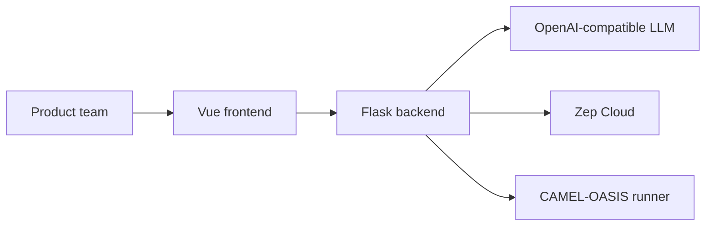
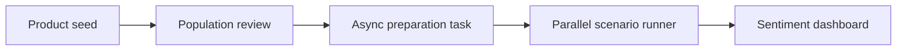

# Architecture Overview

Sentiment Simulator is a product launch workflow that turns a structured brief into a runnable market model.

## System context

## Public product path

## Launch decisions

- Only the sentiment simulator is part of the public frontend surface.
- Campaign preparation is asynchronous and polled through persisted task state.
- Scenario execution is parallel across baseline, competitive, and crisis runs.
- Sentiment analysis is cached and invalidated when simulation action logs change.
- Legacy report and interaction flows remain backend-capable but are not launch-critical UI.

## Architectural risks addressed

- The previous docs described one-after-another campaign execution while the code already ran in parallel.
- The frontend exposed unfinished legacy routes that were not launch-ready.
- Production runtime defaults were still development-oriented.
- Sentiment refreshes recalculated expensive analysis instead of using persisted cache state.
