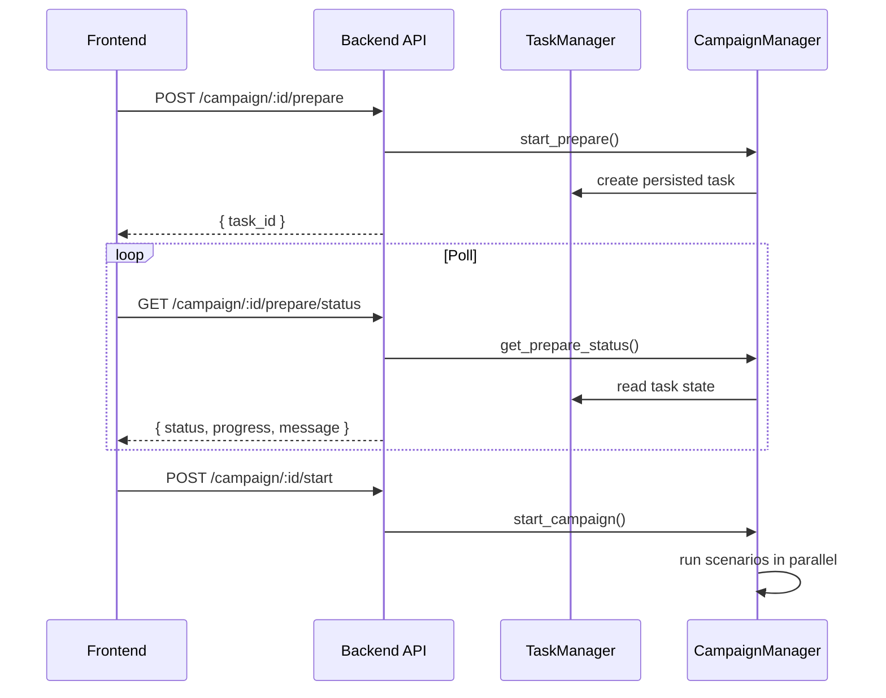

# Backend Architecture

The backend is a Flask application that owns orchestration, task persistence, graph construction, scenario execution, and sentiment analysis.

## Core modules

- `app/config.py`: runtime settings, CORS origins, secret enforcement, launch defaults.
- `app/__init__.py`: app factory, origin-restricted CORS, request logging policy, optional frontend serving.
- `app/models/task.py`: persisted background task state used by graph builds, report jobs, and campaign preparation.
- `app/services/campaign_manager.py`: three-scenario orchestration, async preparation, parallel execution, event injection.
- `app/services/sentiment_analyzer.py`: cached sentiment analysis keyed by action-log signature and threshold settings.

## API surface used by the launch frontend

- `POST /api/sentiment/seed/validate`
- `POST /api/sentiment/seed/preview`
- `GET /api/sentiment/archetypes`
- `POST /api/graph/ontology/generate`
- `POST /api/graph/build`
- `GET /api/graph/task/:task_id`
- `GET /api/graph/data/:graph_id`
- `POST /api/sentiment/campaign/create`
- `POST /api/sentiment/campaign/:id/prepare`
- `GET /api/sentiment/campaign/:id/prepare/status`
- `POST /api/sentiment/campaign/:id/start`
- `GET /api/sentiment/campaign/:id`
- `POST /api/sentiment/campaign/:id/inject`
- `GET /api/sentiment/campaign/:id/sentiment`
- `GET /api/sentiment/campaign/:id/compare`

## Launch behavior

## Non-launch scope

The report/chat subsystem remains in the backend, but it is not part of the release-critical frontend flow. It should be treated as experimental until it moves to structured tool calling and lower-latency defaults.
