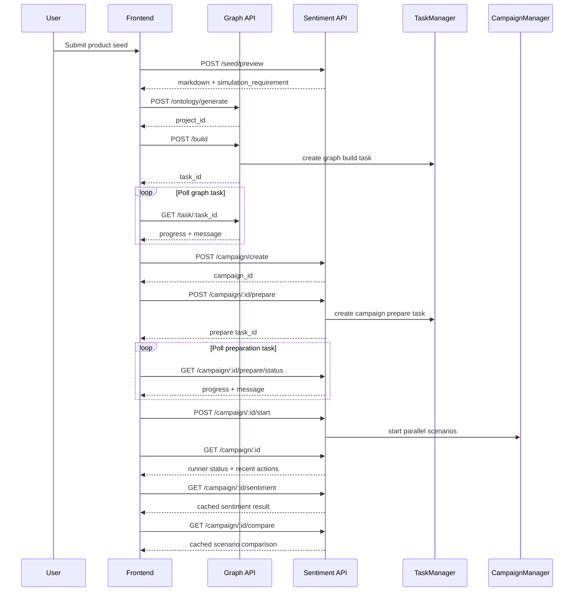

# Data Flow

## Sentiment campaign flow

## Cache invalidation rule

Sentiment analysis is reused until any simulation action log changes in size or modification time. When a log changes, the next request recalculates and replaces the cached analysis entry.
