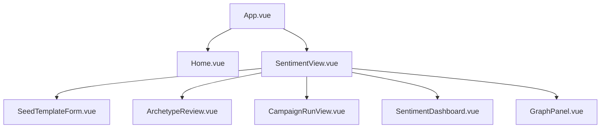

# Frontend Architecture

The frontend is a Vue 3 single-page application that now ships only the sentiment simulator launch path.

## Routed surface

- `/`: launch landing page
- `/sentiment`: new campaign workflow
- `/sentiment/campaign/:campaignId`: resume dashboard view
- legacy `/process`, `/simulation`, `/report`, and `/interaction` routes redirect to `/sentiment`

## Launch component tree

## State model

- Session storage keeps the current campaign context during navigation and refresh.
- Graph building uses task polling through `api/graph.js`.
- Campaign preparation uses dedicated polling through `api/sentiment.js`.
- Dashboard refreshes use cached backend analysis, so repeat loads stay fast.

## Launch rationale

Removing legacy route imports keeps unfinished views out of the production bundle and narrows the public UX to one coherent product path.
